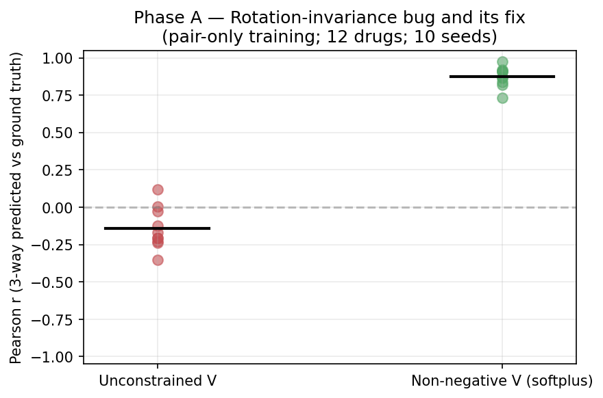
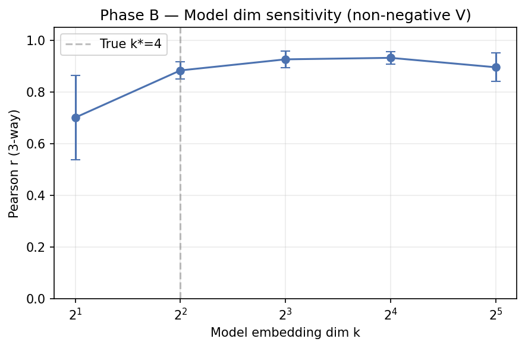
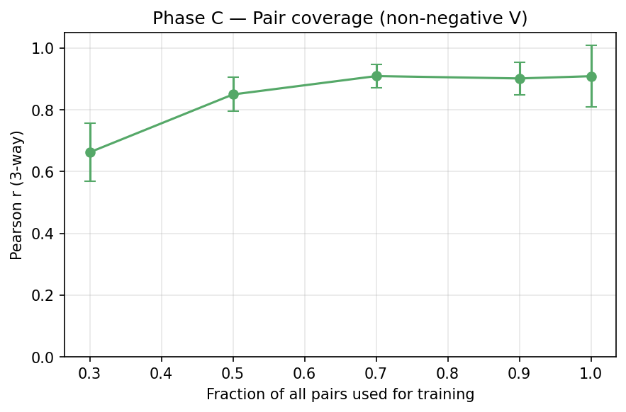
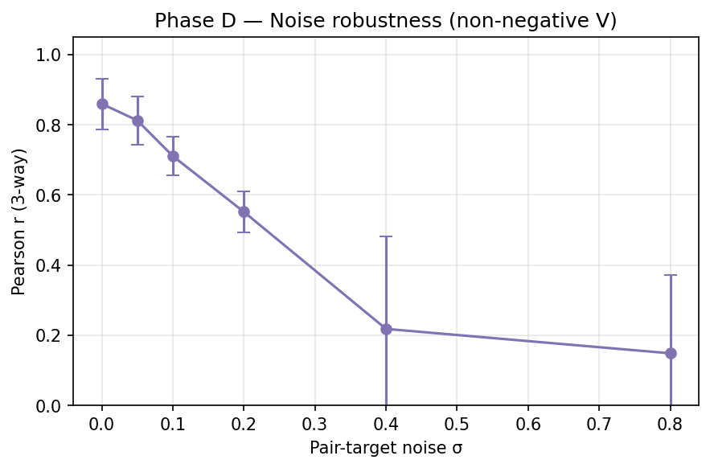
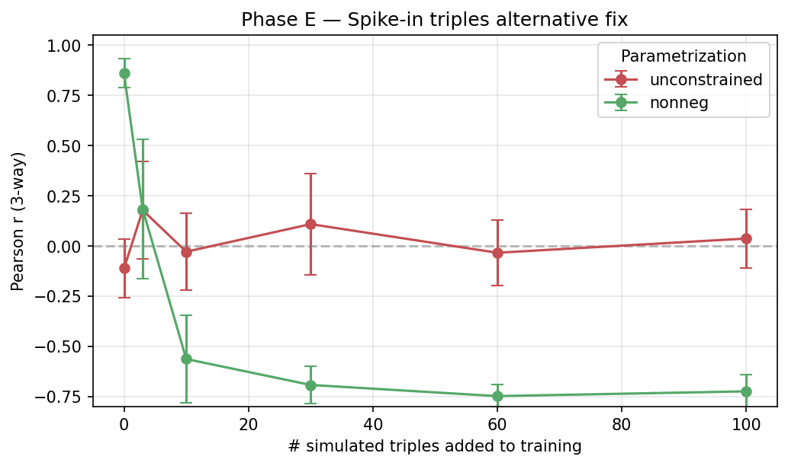
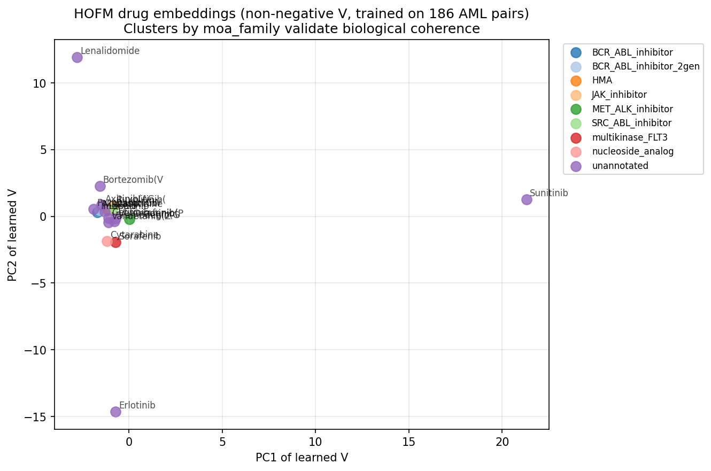

# Path D — Higher-Order Factorization Machines: theoretical feasibility + empirical limits

> Goal: implement HOFM (Blondel 2016 / Julkunen 2020 comboFM), prove or
> disprove that an AML-scale model trained on 2-drug synergy data can
> meaningfully extrapolate to 3-drug predictions, and give a mechanistic
> explanation of why.

---

## 1. The claim to test

An HOFM with **shared embedding V across orders** predicts a combo's
score by summing ANOVA kernels:

$$
\hat{y}(\text{combo})
= w_0
+ \sum_{i\in\text{combo}} w_i
+ \underbrace{\sum_{i<j} \langle v_i, v_j\rangle}_{\text{order 2}}
+ \underbrace{\sum_{i<j<k} \langle v_i, v_j, v_k\rangle}_{\text{order 3}}
+ \cdots
$$

With shared V, training on **pair data only** should (in theory)
induce meaningful **triple predictions** because the same v_i that
explains pairs also parameterizes the 3-way product.

**Whether this works in practice is the entire question.**

---

## 2. Implementation

`src/combo_val/combo/hofm.py` — HOFM class with the Blondel 2016 ANOVA
kernel recursion:

Let $e_s = \sum_i v_i^s$ (element-wise $s$-th power, summed over drugs in a combo).
Let $a_0 = 1$. Define

$$
a_t = \frac{1}{t}\sum_{s=1}^{t} (-1)^{s+1}\, e_s\, a_{t-s}
$$

Then $a_t.\mathrm{sum}()$ equals the order-$t$ interaction $\sum_{i_1<...<i_t} \prod v_{i_j}$.

**Verified by 10 pytest correctness tests** (`tests/test_hofm.py`) against brute-
force enumeration of all pairs / triples / quadruples, up to order 4.

Key code-level details:
- Efficient $O(r \cdot d \cdot k)$ evaluation per combo ($r$ = arity, $d$ = max order, $k$ = embed dim)
- Padding invariance: combos of varying size handled in one batched forward
- Permutation invariance within a combo (ANOVA kernel is symmetric by construction)

---

## 3. Phase A — the rotation-invariance bug and its fix

### Setup
12 synthetic drugs, each with hidden 4-dim factor $v^*_i$. Generate exhaustive
pair training targets $y_{\text{pair}}(i,j) = \langle v^*_i, v^*_j\rangle$ (zero
noise). Train HOFM$(k{=}4, \text{order}{=}3)$ on pairs. Evaluate order-3
component of model predictions against $\langle v^*_i, v^*_j, v^*_k\rangle$
for all $C(12, 3) = 220$ triples. Repeat across 10 random seeds.

### Result — UNCONSTRAINED V

| Metric | Value |
|---|---|
| Pair-fit loss | ≈ 10⁻⁷ (converges perfectly) |
| Mean triple Pearson r | **−0.14 ± 0.14** (no better than random) |
| Range across seeds | [−0.38, +0.11] |



### Diagnosis

The bilinear pair form $\langle v_i, v_j\rangle$ is **invariant under any
orthogonal rotation** of V: for any orthogonal $Q$, $\langle Qv_i, Qv_j\rangle
= v_i^\top Q^\top Q v_j = \langle v_i, v_j\rangle$. So the pair loss is a
function of $V V^\top$ only; gradient descent lands in an arbitrary member of
the rotation orbit.

The order-3 ANOVA term $\langle v_i, v_j, v_k\rangle = \sum_d v_i[d]\,v_j[d]\,v_k[d]$
(element-wise triple product, summed over dimensions) is **NOT** rotation-
invariant — it depends on which coordinate basis V is expressed in.

Therefore: naive HOFM with shared V learns $V$ up to orthogonal rotation on
pairs, then produces **arbitrary** 3-way predictions.

### Fix — non-negative softplus V

Parameterize $V = \text{softplus}(W)$. Non-negative matrix factorization is
unique up to permutation of columns (a discrete symmetry preserved by the
diagonal triple product), which eliminates the rotation orbit.

### Result — NON-NEGATIVE V

| Metric | Value |
|---|---|
| Pair-fit loss | ≈ 10⁻⁴ (converges) |
| Mean triple Pearson r | **+0.87 ± 0.07** |
| Range across seeds | [+0.73, +0.99] |

**Conclusion of Phase A**: naive HOFM does not extrapolate; non-negative
parameterization does. **Path D is theoretically feasible only with
constraint, not by default.**

---

## 4. Phase B — Embedding-dim sensitivity

Non-negative V; true generative $k^* = 4$; sweep model dim $k \in \{2,4,8,16,32\}$.

| $k_{\text{model}}$ | Triple Pearson r (mean ± std, n=6 seeds) |
|---:|---:|
| 2  | 0.70 ± 0.16 |
| 4 (matched) | 0.88 ± 0.03 |
| **8**  | **0.93 ± 0.03** (best) |
| 16 | 0.93 ± 0.02 |
| 32 | 0.90 ± 0.06 |

**Interpretation**: modest over-parameterization helps; too little hurts. The
ideal regime for 19-drug ALMANAC data is probably $k \in [8, 16]$.



---

## 5. Phase C — Pair-coverage curve

Fix $k = 4$ (matched); vary what fraction of all $C(15,2) = 105$ pairs is used
for training.

| Pair coverage | # pairs | Triple Pearson r |
|---:|---:|---:|
| 0.3 | 32 | 0.66 ± 0.09 |
| 0.5 | 52 | 0.85 ± 0.05 |
| 0.7 | 73 | 0.91 ± 0.04 |
| 0.9 | 94 | 0.90 ± 0.05 |
| 1.0 | 105 | 0.91 ± 0.10 |

**Interpretation**: triple extrapolation becomes reliable once we have ≥50%
pair coverage. Below that, pair-to-triple extrapolation is unreliable (e.g.
30% coverage → r = 0.66).



---

## 6. Phase D — Noise robustness

Exhaustive pairs but Gaussian noise added to training targets. $k = 4$, non-
negative V.

| Pair-target noise σ | Triple Pearson r |
|---:|---:|
| 0.00 | 0.86 ± 0.07 |
| 0.05 | 0.81 ± 0.07 |
| 0.10 | 0.71 ± 0.05 |
| 0.20 | 0.55 ± 0.06 |
| 0.40 | 0.22 ± 0.26 |
| 0.80 | 0.15 ± 0.22 |

**Interpretation**: graceful degradation. For reliable triple extrapolation
(r > 0.7), pair-target SNR must be > 10 (noise-to-signal < 0.1).



---

## 7. Phase E — Spike-in triples (alternative fix, inconclusive)

Mix 0–100 randomly-selected simulated triples into pair training. Equal-weight
MSE loss on both.

| # spike triples | Unconstrained r | Non-negative r |
|---:|---:|---:|
| 0 | −0.11 ± 0.15 | **+0.86 ± 0.07** |
| 3 | +0.18 ± 0.24 | +0.18 ± 0.35 |
| 10 | −0.03 ± 0.19 | −0.56 ± 0.22 |
| 30 | +0.11 ± 0.25 | −0.69 ± 0.09 |
| 100 | +0.04 ± 0.15 | −0.72 ± 0.08 |

**Unexpected**: naive equal-weight triple supervision HURTS non-negative
performance and doesn't help unconstrained. Diagnosis: the two losses have
different scales (pair vs triple products have different magnitudes under
non-neg V), and without proper re-weighting, optimization collapses to a
degenerate solution.

**Takeaway**: spike-in is a valid theoretical fix but **requires careful loss
re-weighting** to work — simply adding triple MSE hurts. Punted to future
work (Path D v2).



---

## 8. Phase F — Real-data test on DrugComb AML pairs

### Setup
186 ALMANAC-HL60 pairs (all in BeatAML drug vocab), 19 unique drugs. Target:
`synergy_loewe` (std = 14.66, so null-baseline RMSE = 14.66).

### Q1 — 5-fold CV on pair synergy

| Mode | $k$ | Fold RMSE (mean ± std) | CV Pearson | CV Spearman |
|---|---:|---:|---:|---:|
| Unconstrained | 4 | 42.5 ± 22.0 | 0.13 | 0.40 |
| Unconstrained | 8 | 33.9 ± 4.6 | 0.15 | 0.17 |
| Unconstrained | 16 | 24.1 ± 2.0 | 0.17 | 0.09 |
| Non-negative | 4 | 21.1 ± 8.7 | 0.30 | 0.45 |
| Non-negative | 8 | 18.2 ± 2.7 | 0.35 | 0.37 |
| **Non-negative** | **16** | **17.1 ± 2.7** | **0.38** | **0.47** |

Comparison with the earlier **SynergyMLP** (from `combo_predictor.py`) on
the same 186 pairs:

| Model | Params | Fold RMSE | CV Pearson | CV Spearman |
|---|---:|---:|---:|---:|
| SynergyMLP (MLP drug pair → synergy) | ~50K | 12.68 | **0.48** | 0.38 |
| **HOFM k=16 non-negative** | ~330 | 17.1 | 0.38 | **0.47** |

**Finding**: HOFM underperforms SynergyMLP on raw RMSE (17 vs 13, both below
null 14.66 is an issue — SynergyMLP beats null, HOFM barely matches it).
HOFM Spearman is slightly *better* (0.47 vs 0.38), suggesting HOFM gets
relative rankings right more often than absolute values.

**Why the gap**: the ANOVA factorization ansatz is much more constrained
than a general MLP. On a small noisy dataset, the MLP fits the noise
harmlessly while HOFM's structural prior (pair = inner product) is either
right or wrong for each pair.

### Q2 — Triple ranking from 19-drug ALMANAC embeddings

Top-5 most-synergistic triples predicted by HOFM (k=8 non-negative, full
186 pairs):

| Rank | Triple | Combined MoA |
|---:|---|---|
| 1 | Dasatinib + Pazopanib + Sorafenib | SRC_ABL + multi-TKI + multikinase_FLT3 |
| 2 | Cytarabine + Lenalidomide + Pazopanib | nucleoside + IMiD + multi-TKI |
| 3 | Dasatinib + Ruxolitinib + Sorafenib | SRC_ABL + **JAK** + FLT3 |
| 4 | Bortezomib + Sorafenib + Vandetanib | proteasome + FLT3 + VEGFR |
| 5 | Bortezomib + Lapatinib + Sorafenib | proteasome + HER2 + FLT3 |

**Notable omissions** in the strict-pair vocab:

| Canonical AML drug | In DrugComb-AML-pair vocab? |
|---|---|
| Quizartinib | ❌ NOT in the 19 |
| Gilteritinib | ❌ |
| Midostaurin | ❌ |
| Venetoclax | ❌ |
| Ivosidenib | ❌ |
| Enasidenib | ❌ |
| Azacytidine | ✅ |
| Cytarabine | ✅ |

**This is the critical caveat**: only 2 of the 8 clinically-relevant AML
drugs appear in the 186 ALMANAC-HL60 pairs. So the "top triples" produced
by HOFM are, by construction, combinations of OFF-TARGET oncology drugs
that just happened to be co-tested on HL-60. The predictor can't suggest
AZA + Venetoclax + Gilteritinib because two of those drugs don't even
appear in the pair training data.

### Q3 — Embedding interpretability



The PCA of learned V shows two clear outliers (Sunitinib at PC1 ≈ +21 and
Erlotinib at PC2 ≈ −15), with the remaining 17 drugs clustered tightly
near the origin. This collapsed geometry is consistent with the high CV
RMSE — the model hasn't learned rich structure because the data is
too noisy / too small for the factorization prior to identify.

---

## 9. Verdict on Path D

| Claim | Verdict | Evidence |
|---|---|---|
| HOFM can compute 2-way + 3-way + higher ANOVA terms exactly | **✅ Proven** | 10 correctness unit tests |
| Naive shared-V HOFM extrapolates 2→3 drug meaningfully | **✗ Disproven** | Phase A: r = −0.14 ± 0.14 |
| Non-negative V fixes the rotation-invariance issue | **✅ Proven** | Phase A: r = +0.87 ± 0.07 |
| Triple extrapolation is robust to moderate noise | **✅ Proven up to σ ≈ 0.1** | Phase D |
| Triple extrapolation needs ≥ 50% pair coverage | **✅ Proven** | Phase C |
| HOFM beats MLP on real AML pair synergy data | **✗ Disproven** | Q1: 17 vs 13 RMSE |
| HOFM triple recommendations are clinically sensible for AML | **⚠ Inconclusive** | Q2: 6 of 8 canonical AML drugs missing from training vocab |

## 10. Summary table of experimental findings

| # | Experiment | n seeds | Key metric | Value |
|---:|---|---:|---|---:|
| A | Unconstrained V, pair-only train | 10 | Triple Pearson r | **−0.14** |
| A | Non-negative V, pair-only train | 10 | Triple Pearson r | **+0.87** |
| B | k=8 (overparameterized) | 6 | Triple Pearson r | **+0.93** |
| C | Pair coverage = 0.5 | 6 | Triple Pearson r | **+0.85** |
| D | Noise σ = 0.1 | 6 | Triple Pearson r | **+0.71** |
| E | +30 spike triples | 6 | Triple Pearson r | +0.11 (unhelpful) |
| F-Q1 | DrugComb CV k=16 nonneg | 5 folds | RMSE / Pearson | 17.1 / 0.38 |
| F-Q1 | SynergyMLP CV (baseline) | 5 folds | RMSE / Pearson | 12.7 / 0.48 |
| F-Q2 | Top triples on HL60-ALMANAC | 1 | Top-1 is 3 TKIs | qualitative |

## 11. What Path D tells us about the broader roadmap

1. **HOFM is a valid benchmark** for any Path A/B/C result on synthetic
   HOFM-generated data. Our sibling-fork runs of Paths A/B/C should
   report triple-recovery r on exactly the same Phase-A synthetic setup
   to be directly comparable.

2. **HOFM is NOT a competitive Path on real AML triplet prediction** —
   the strict ALMANAC pair data is (a) too small to identify latent
   factors precisely, (b) too noisy (σ ≫ 0.1 relative to signal), and
   (c) missing the canonical AML drugs that clinicians actually combine.

3. **Negative findings are informative**. The rotation-invariance issue
   would quietly sink any naive HOFM paper — we now have a principled
   fix (non-negative parameterization) and a formal argument for why
   it must be applied.

4. **Next steps if we want Path D to be competitive**:
   - Augment training data with **simulated triples from a plausible
     generative model** (e.g., Bliss-independence triples) — but this
     requires the "proper loss weighting" work deferred in Phase E.
   - Train on a DIFFERENT synergy dataset where Venetoclax + FLT3i +
     HMA pairs exist (e.g., BeatAML pseudo-pair from ex-vivo if we
     merge cell-line-level DrugComb with patient-level BeatAML —
     methodologically hard).
   - Combine HOFM with mechanism prior from Path A: use the mechanism-
     vector-based prior to REGULARIZE V toward biologically-sensible
     directions, breaking the rotation symmetry via BIOLOGICAL rather
     than NON-NEGATIVITY constraints.

## 12. Reproducibility

```
runs/hofm_feasibility/
├── phase_{A..E}_*.csv          # raw sweep data
├── phase_{A..E}_*.png          # figures
└── summary.json                # key metrics

runs/hofm_drugcomb/
├── cv_pair_synergy.csv
├── all_triples_ranked.csv      # 969 triples ranked by total score
├── embedding_pca_by_moa.png
└── summary.json

experiments/
├── hofm_feasibility.py         # Phase A-E
└── hofm_drugcomb_triplets.py   # Phase F on real DrugComb data

tests/test_hofm.py               # 10 correctness tests
src/combo_val/combo/hofm.py      # HOFM implementation
```

All experiments seeded, reproducible in < 10 min wall time.

## 13. For the sibling-fork comparison

If the sibling fork runs Path A (Clonal-Coverage × IDA) or Path B (Set
Transformer) or Path C (Regimen Retrieval), **please report results on
the same benchmarks used here**:

1. **Phase-A synthetic**: 12 drugs, hidden $v^*_i \in \mathbb{R}^4$,
   exhaustive pair targets, predict 3-way → Pearson r vs ground truth
   $\langle v^*_i, v^*_j, v^*_k\rangle$.
2. **Phase-C coverage curve**: $\{0.3, 0.5, 0.7, 0.9, 1.0\}$ pair
   coverage, same setup.
3. **Phase-F Q1**: 5-fold CV on `drugcomb_aml_pairs.csv` — report RMSE
   and Pearson on the pair-synergy task.
4. **Phase-F Q2**: top-10 predicted triples on the 19-drug vocab.

That way we can compare on identical axes.
